# Octopus

This application is used to control [micropython esp8266](https://github.com/shajen/micropython_esp8266) board. Scans WiFi network for 
available devices.

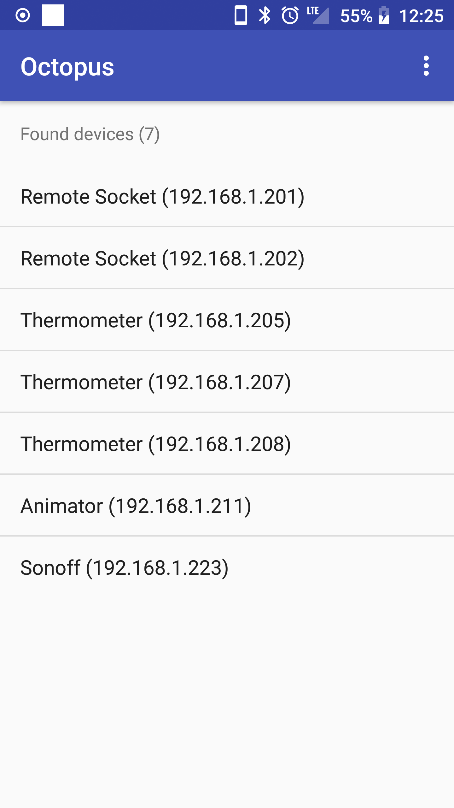 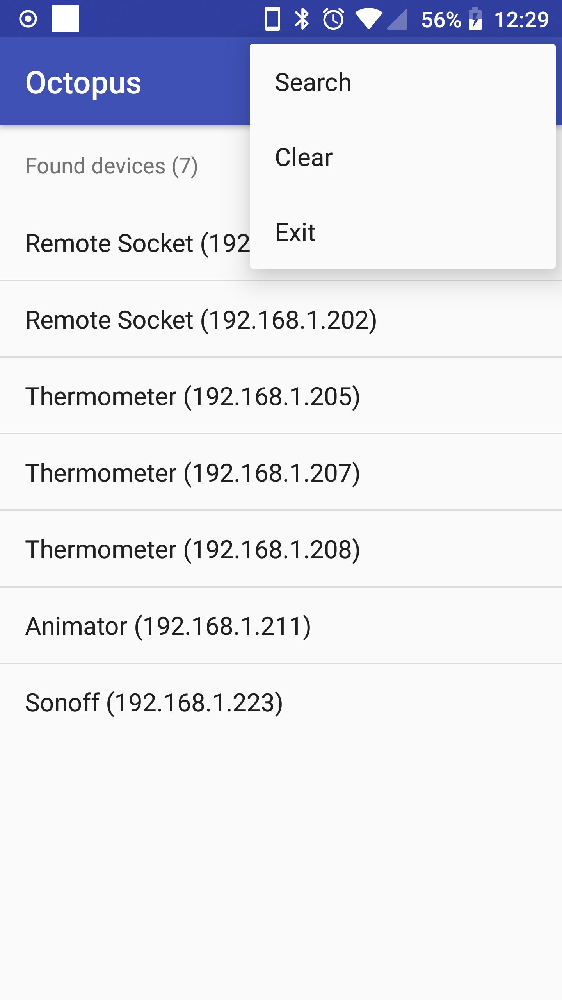 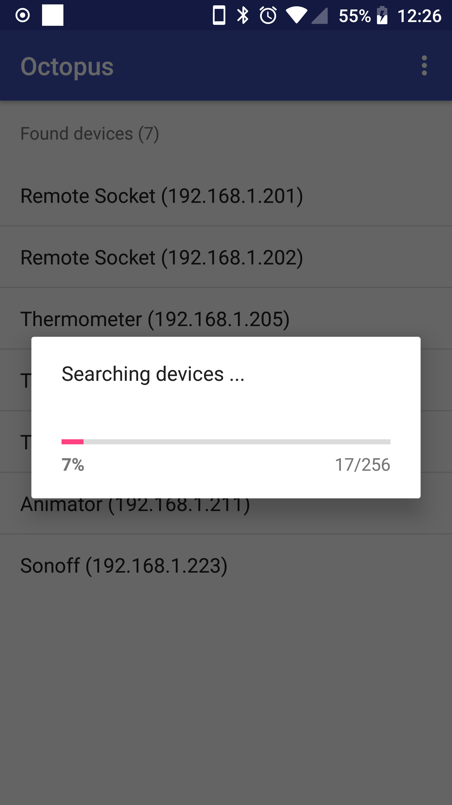 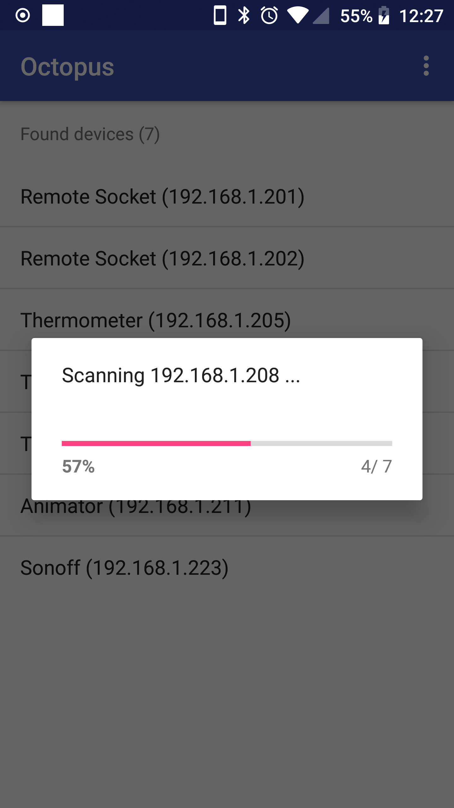

## Projects

Supported projects are listed below.

### Animator

It controls WS2812B leds (and similiar). It offers few animations, solid color, changing leds count, animation speed. Everything can be changed via REST API or Android app.

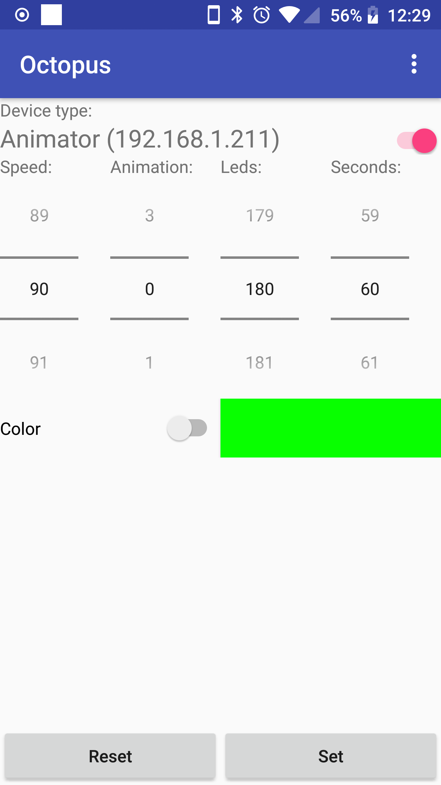 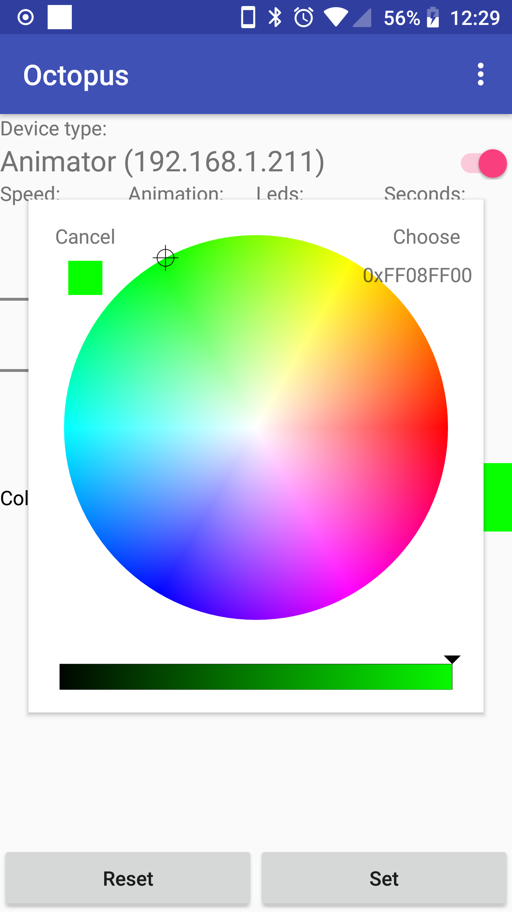 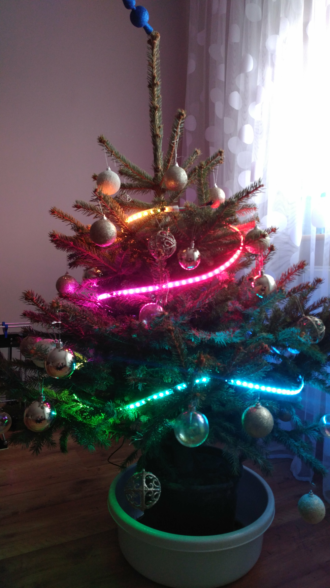 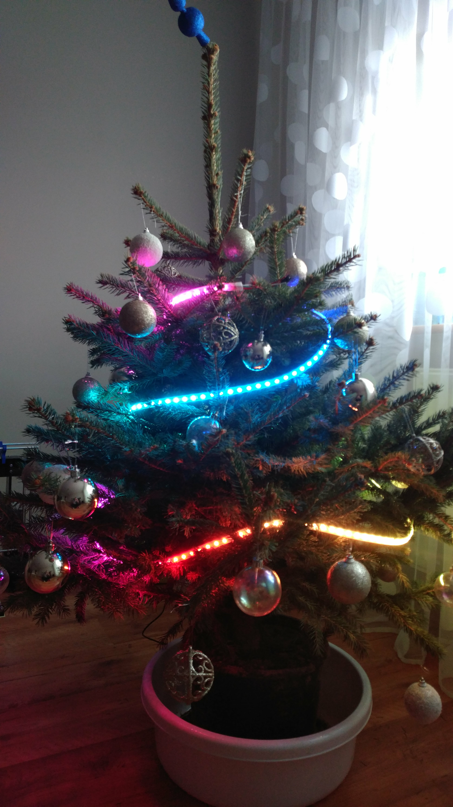

### Remote Socket

It controls pins (you can set high or low state). Pins can be changed via REST API or Android app. I used it with relays (hence the name, not entirely correct).

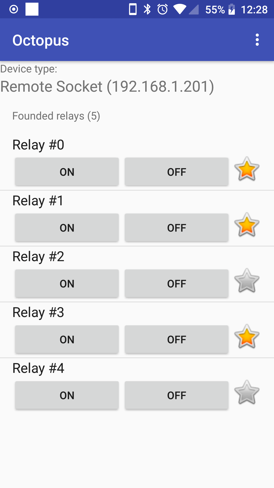

### Sonoff

It controls sonoff device (for now support S20, S26, switch, touch). It supports power off and on by the switch. Led indicator is also supported. It can be controlled via REST API or Android app

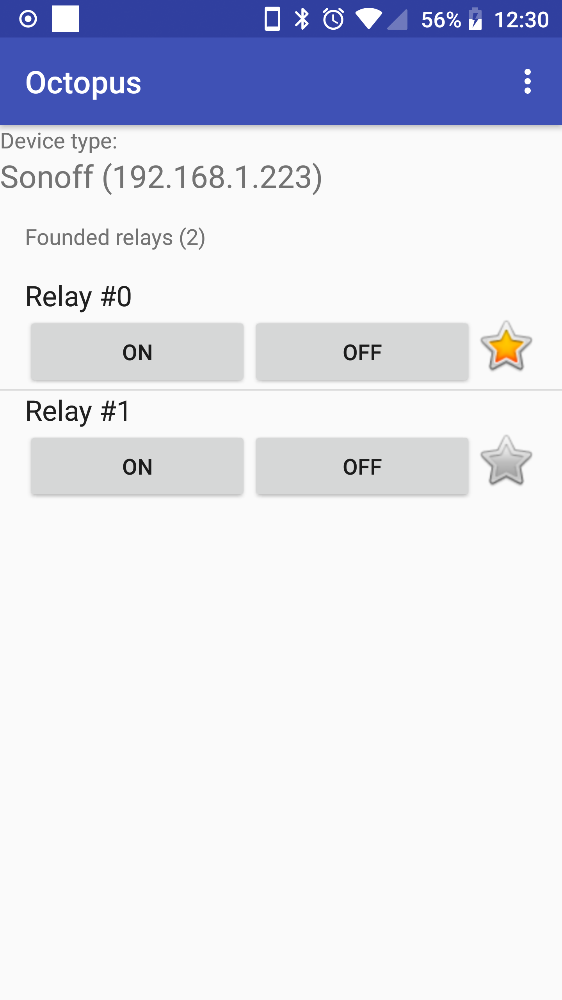 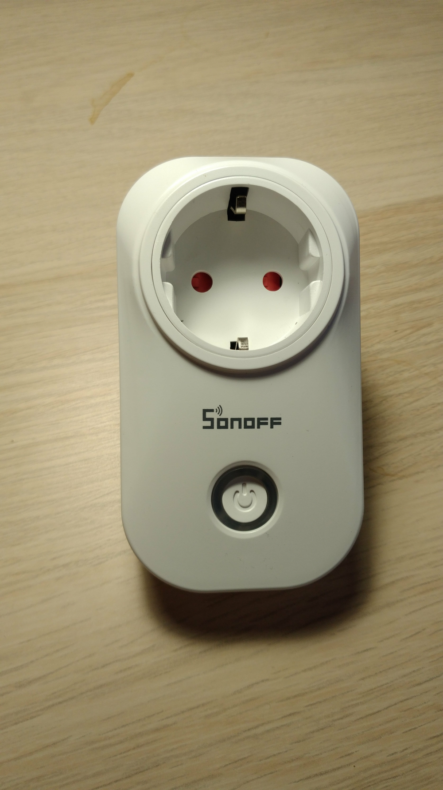 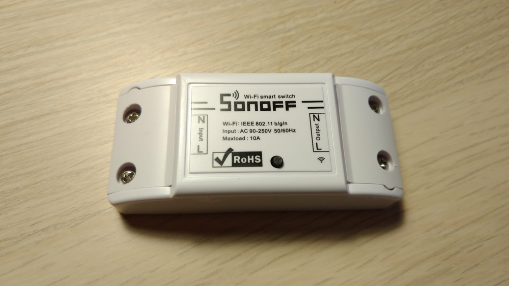 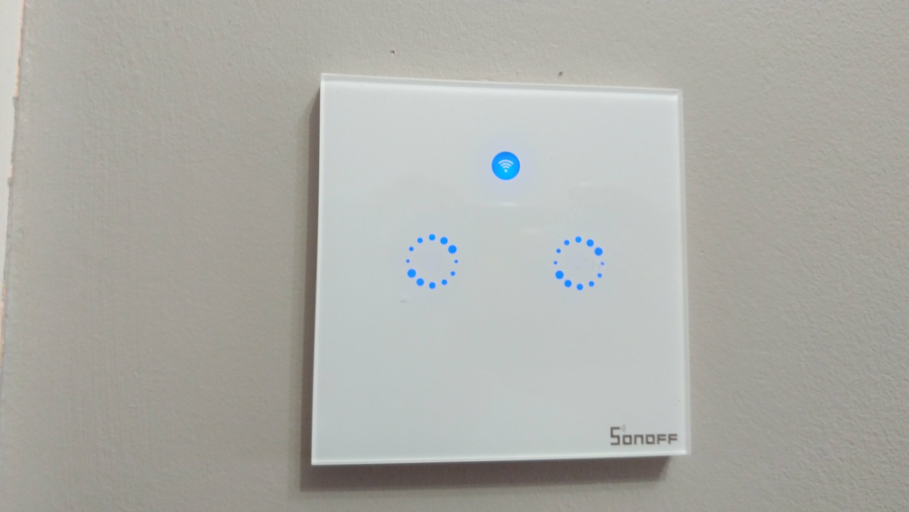

## Build

Import an existing project in the Android studio and build.

## Install

The application is available in [Google Play](https://play.google.com/store/apps/details?id=pl.shajen.octopus).

## Android

### Working API versions

It should correctly work on Android 4.4 (API 19) and above.

### Tested API versions

It was tested on android 8.1 (API 27).

## Contributing

In general don't be afraid to send pull request. Use the "fork-and-pull" Git workflow.

1. **Fork** the repo
2. **Clone** the project to your own machine
3. **Commit** changes to your own branch
4. **Push** your work back up to your fork
5. Submit a **Pull request** so that we can review your changes

NOTE: Be sure to merge the **latest** from **upstream** before making a pull request!

## Donations

If you enjoy this project and want to thanks, please use follow link:

## License

- *[GPLv3 license](https://www.gnu.org/licenses/gpl.html)*

## Acknowledgments

- *[MicroPython](https://micropython.org/)*
